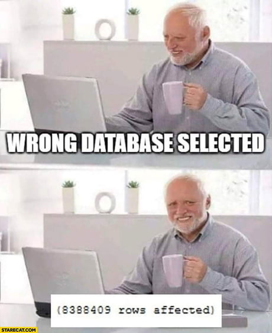

# Session – 2026-04-07

## Topics covered
- Vector Search

## What I understood
- The theory behind how it works

## What is still confusing
- Specifically how the vector search queries works

## Questions
- How specific this queries can be?

## Related concepts
- [Concept name](../concepts/concept-name.md)

## Resources used
- See `resources/`
