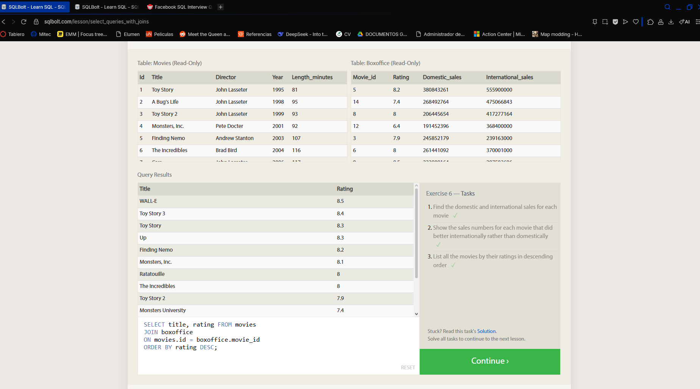
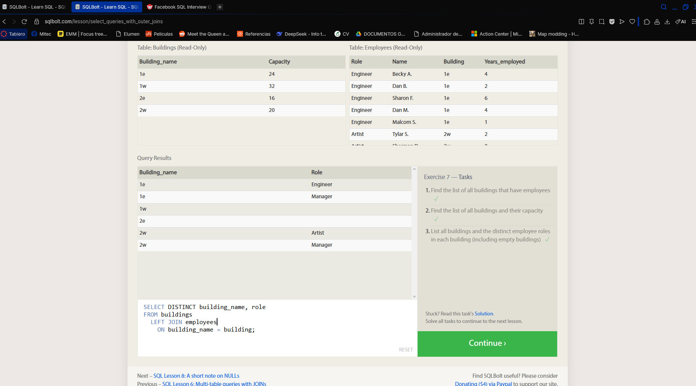
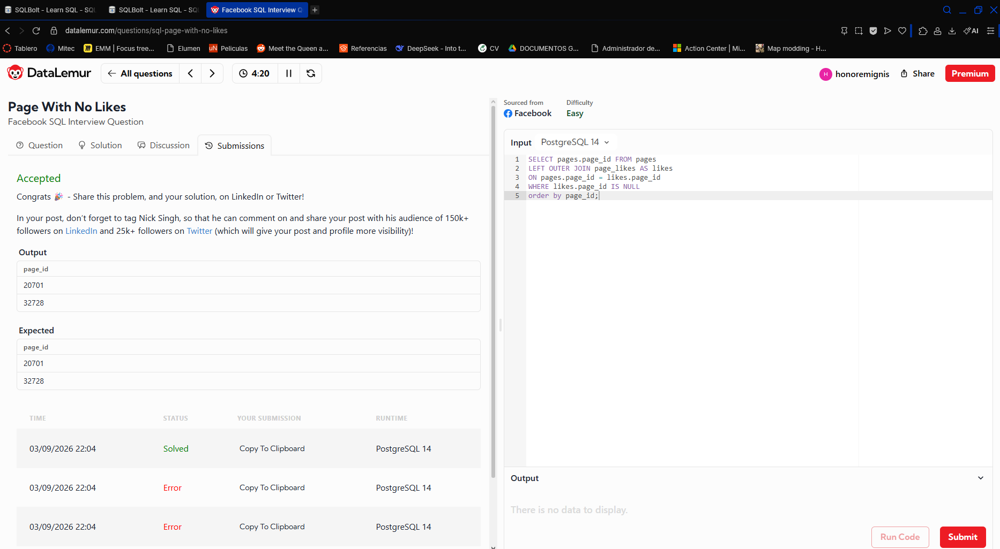

# SQL Lesson 6: Multi-table queries with JOINs

## Problem
In this exercise, we practice how with two tables can be joined in different ways

# SQL Lesson 7: OUTER JOINs

## Problem
In this exercise, we use the OUTER and LEFT JOIN

# Page With No Likes 

## Problem
In this Interview-Like Question we have two tables containing data about Facebook Pages and their respective likes and we need to find the pages with no likes

