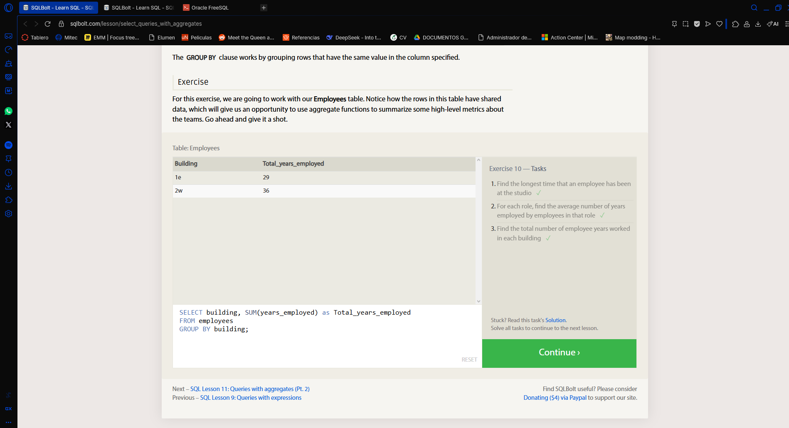
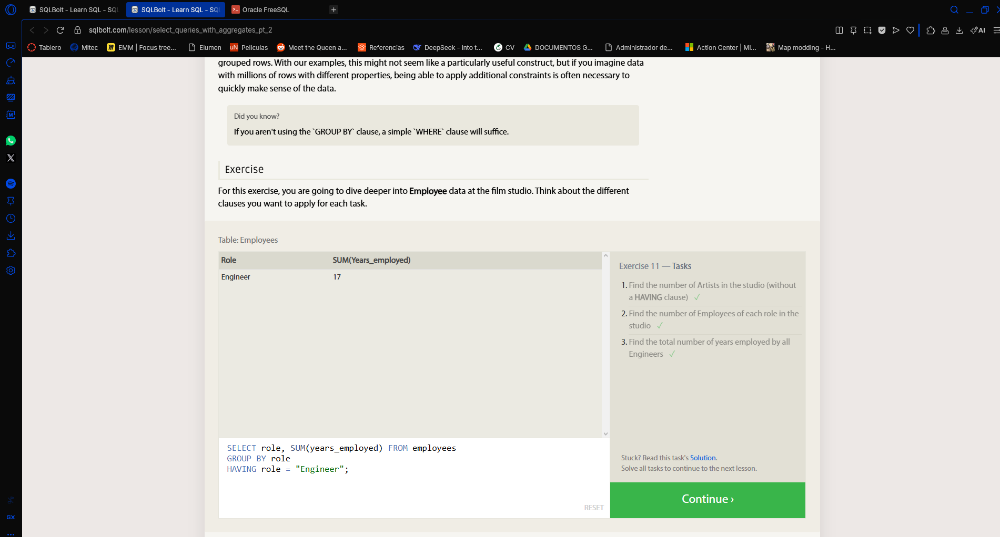
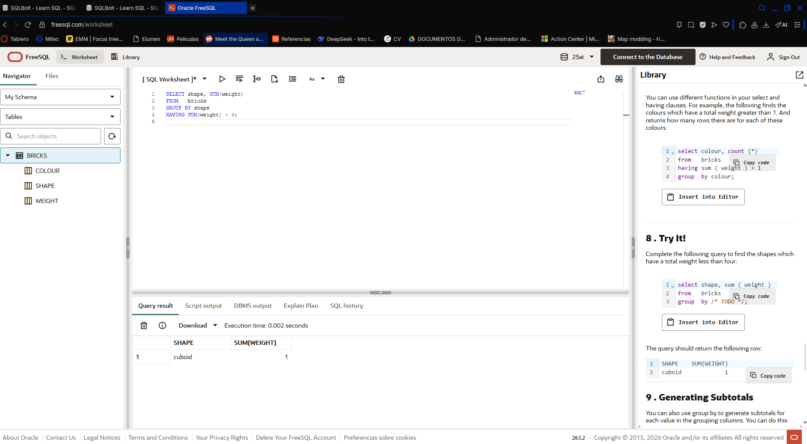

# SQL Lesson 10: Queries with aggregates (Pt. 1)

## Problem
For the SQLBolt we have to learn and use Queries with aggregates.

# SQL Lesson 11: Queries with aggregates (Pt. 2)

## Problem
In this we work with more complex queries around the aggregates

# Aggregating Rows: Databases for Developers

## Problem
Summarise data with aggregate functions and group by

