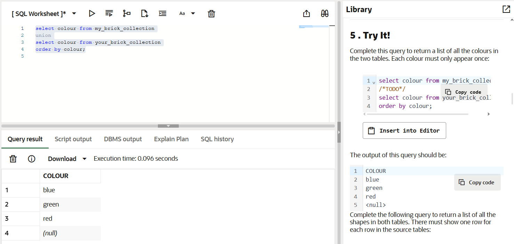
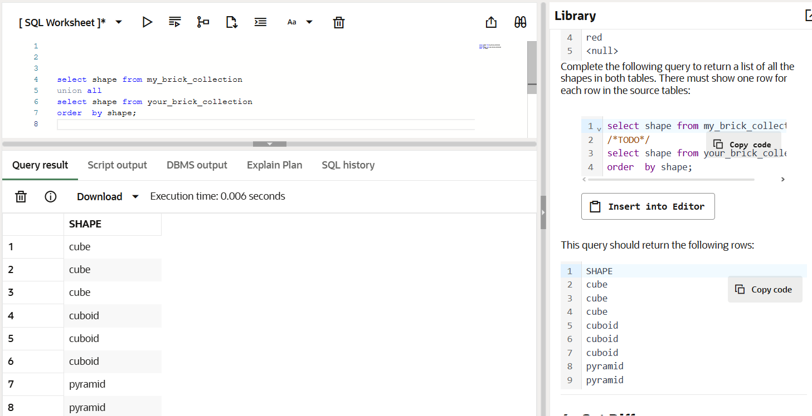
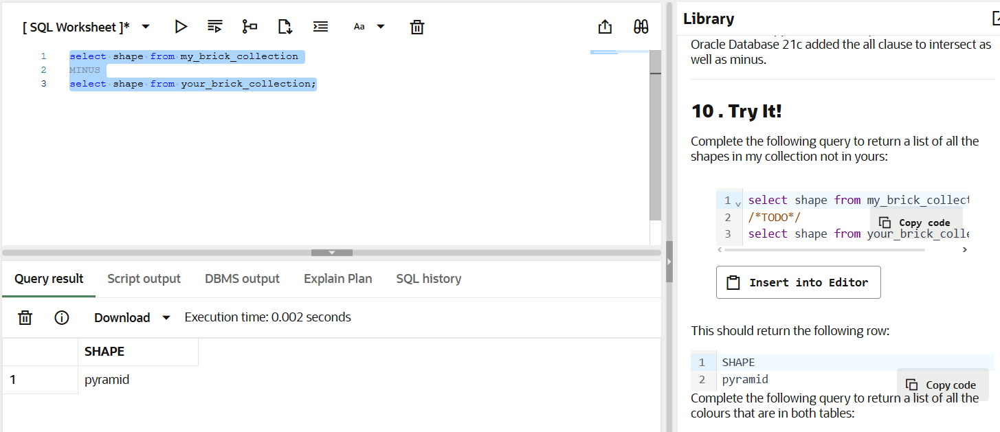
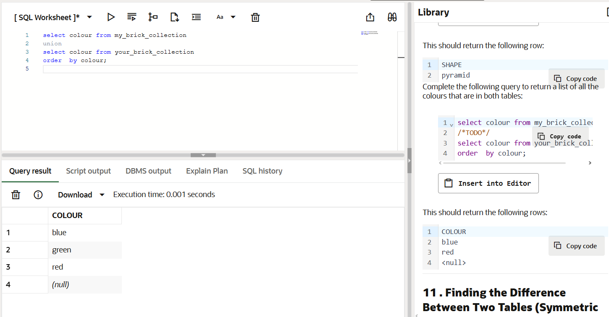

# Union, Minus, and Intersect: Databases for Developers

## 5.1 Try it!
Complete this query to return a list of all the colours in the two tables. Each colour must only appear once:

## 5.2 Try it!
Complete the following query to return a list of all the shapes in both tables. There must show one row for each row in the source tables

## 10.1 Try it!
Complete the following query to return a list of all the shapes in my collection not in yours:

## 10.2 Try it!
Complete the following query to return a list of all the colours that are in both tables:

